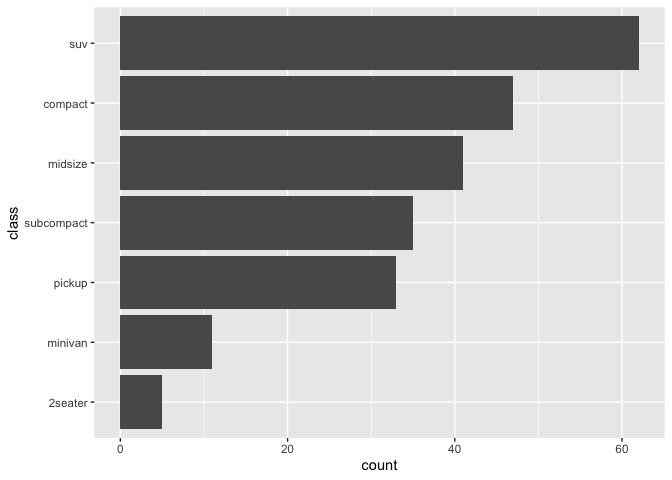

<!-- README.md is generated from README.Rmd. Please edit that file -->

# ezEDA

<!-- badges: start -->

<!-- badges: end -->

The goal of ezEDA is to enable users to create visualizations using
functions based on the data analysis task rather than on plotting
mechanics. It hides the details of the individual ‘ggplot2’ function
calls and allows the user to focus on the end goal. Useful for quick
preliminary explorations. ezEDA provides functions for common
exploration patterns. Some of the ideas in this package are motivated by
Fox (2015, <ISBN:1938377052>).

## Installation

You can install the released version of ezEDA from
[CRAN](https://CRAN.R-project.org) with:

``` r
install.packages("ezEDA")
```

## Example

This is a basic example which shows you how to solve a common problem:

    #> Registered S3 method overwritten by 'GGally':
    #>   method from   
    #>   +.gg   ggplot2


